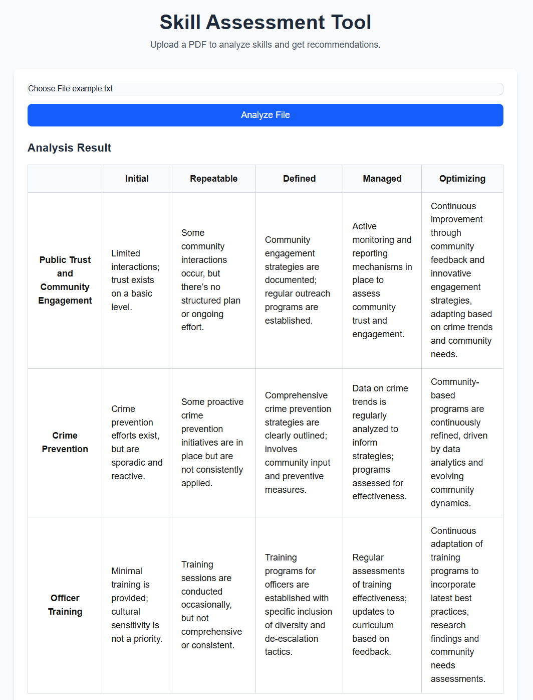

# Skill Assessment Tool

A web-based tool that analyzes skill levels and provides structured assessment results using a capability maturity model framework. This project helps organizations evaluate and track progress across different competency areas.

## Features

- PDF document analysis
- Structured assessment results in a maturity model format
- Clear visualization of competency levels
- Categories breakdown with detailed descriptions
- Assessment across multiple maturity levels (Initial, Repeatable, Defined, Managed, Optimizing)

## Screenshots



## Getting Started

First, run the development server:

```bash
npm run dev
# or
yarn dev
# or
pnpm dev
# or
bun dev
```

Open [http://localhost:3000](http://localhost:3000) with your browser to see the result.

## Technology Stack

- [Next.js](https://nextjs.org) - React framework
- TypeScript
- Tailwind CSS
- OpenAI API

## Development

To start developing:

1. Clone the repository
2. Install dependencies:
   ```bash
   npm install
   ```
3. Set up your environment variables:
   ```
   OPENAI_API_KEY=your_api_key_here
   ```
4. Start the development server:
   ```bash
   npm run dev
   ```

## Contributing

Contributions are welcome! Please feel free to submit a Pull Request.

## License

This project is licensed under the MIT License - see the [LICENSE](LICENSE) file for details.
